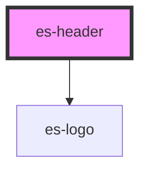

# es-header


<!-- Auto Generated Below -->


## Usage

### Example

```tsx
import { Link } from '@eventstore-ui/router';

export default () => (
    <es-header>
        <Link url={'/'} slot={'left'}>
            <es-logo />
        </Link>
        <es-theme-dropdown slot={'right'} />
        <es-nav
            navTree={[
                {
                    title: 'Link 1',
                    url: '/a',
                },
                {
                    title: 'Link 2',
                    url: '/b',
                },
                {
                    title: 'Link 3',
                    url: '/c',
                },
            ]}
            slot={'under'}
        />
    </es-header>
);
```


## Slots

| Slot         | Description                                                                                                                                  |
| ------------ | -------------------------------------------------------------------------------------------------------------------------------------------- |
| `"backdrop"` | Slot an svg to use as a backdrop                                                                                                             |
| `"center"`   | The center of the header. Place some navigational elements.                                                                                  |
| `"left"`     | The left of the header. By default shows an eventstore logo, linking to '/'.                                                                 |
| `"right"`    | The right of the header. Place some navigational elements.                                                                                   |
| `"under"`    | Underneath the header. Place an es-nav or other. Automatically sets the `layout-header-under-height` css var with the height of the content. |


## Shadow Parts

| Part         | Description                 |
| ------------ | --------------------------- |
| `"backdrop"` | the backdrop container      |
| `"center"`   | The center of the header.   |
| `"header"`   | The wrapping header element |
| `"left"`     | The left of the header.     |
| `"right"`    | The right of the header.    |
| `"under"`    | Underneath the header.      |


## Dependencies

### Depends on

- [es-logo](../es-logo)

### Graph


----------------------------------------------


