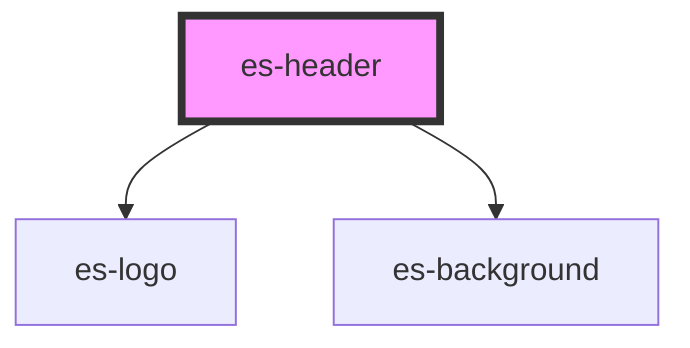

# es-header

<!-- Auto Generated Below -->

## Properties

| Property     | Attribute    | Description | Type                            | Default     |
| ------------ | ------------ | ----------- | ------------------------------- | ----------- |
| `background` | `background` |             | `"dark" \| "default" \| "none"` | `'default'` |

## Dependencies

### Depends on

- [es-logo](../es-logo)
- [es-background](../es-background)

### Graph

----------------------------------------------

