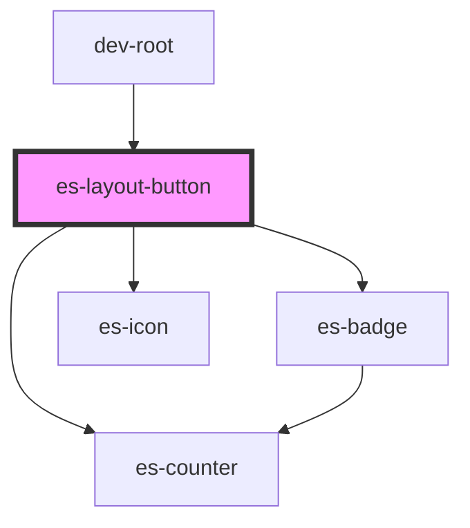

# docs-sidebar-link

<!-- Auto Generated Below -->


## Usage

### Example

```tsx
import { Link } from '@eventstore/router';
import { randomIcon } from 'helpers';

export default () => (
    <es-sidebar>
        <es-layout-section sectionTitle={'Buttons'}>
            <es-layout-button onClick={console.log}>
                {'Example button'}
            </es-layout-button>
            <es-layout-button active onClick={console.log}>
                {'I am active'}
            </es-layout-button>
            <es-layout-button onClick={console.log}>
                {'Example button'}
            </es-layout-button>
            <es-layout-button disabled onClick={console.log}>
                {'Disabled example  '}
            </es-layout-button>
        </es-layout-section>
        <es-layout-section sectionTitle={'With Icon'}>
            <es-layout-button onClick={console.log} icon={randomIcon()}>
                {'With Icon'}
            </es-layout-button>
            <es-layout-button
                disabled
                onClick={console.log}
                icon={randomIcon()}
            >
                {'Disabled'}
            </es-layout-button>
            <es-layout-button onClick={console.log} icon={randomIcon()}>
                {'Another'}
            </es-layout-button>
            <es-layout-button onClick={console.log} icon={randomIcon()}>
                {'More Icon'}
            </es-layout-button>
        </es-layout-section>
        <es-layout-section sectionTitle={'Alert levels'}>
            <es-layout-button
                alertLevel={'error'}
                onClick={console.log}
                icon={randomIcon()}
            >
                {'Error'}
            </es-layout-button>
            <es-layout-button
                alertLevel={'warning'}
                onClick={console.log}
                icon={randomIcon()}
            >
                {'Warning'}
            </es-layout-button>
            <es-layout-button
                alertLevel={'okay'}
                onClick={console.log}
                icon={randomIcon()}
            >
                {'Okay'}
            </es-layout-button>
            <es-layout-button onClick={console.log} count={12}>
                {'Counter'}
            </es-layout-button>
        </es-layout-section>
        <es-layout-section sectionTitle={'Level Example'}>
            <es-layout-button onClick={console.log} level={1}>
                {'Level 1'}
            </es-layout-button>
            <es-layout-button onClick={console.log} level={1}>
                {'Level 1'}
            </es-layout-button>
            <es-layout-button onClick={console.log} level={2}>
                {'Level 2'}
            </es-layout-button>
            <es-layout-button onClick={console.log} level={2}>
                {'Level 2'}
            </es-layout-button>
            <es-layout-button onClick={console.log} level={1}>
                {'Level 1'}
            </es-layout-button>
            <es-layout-button onClick={console.log} level={2}>
                {'Level 2'}
            </es-layout-button>
            <es-layout-button onClick={console.log} level={3}>
                {'Level 3'}
            </es-layout-button>
            <es-layout-button onClick={console.log} level={3}>
                {'Level 3'}
            </es-layout-button>
            <es-layout-button onClick={console.log} level={1}>
                {'Level 1'}
            </es-layout-button>
        </es-layout-section>
    </es-sidebar>
);
```


## Properties

| Property     | Attribute     | Description                                                    | Type                                                                 | Default     |
| ------------ | ------------- | -------------------------------------------------------------- | -------------------------------------------------------------------- | ----------- |
| `active`     | `active`      | If the button should display as active                         | `boolean`                                                            | `false`     |
| `alertLevel` | `alert-level` | Display a dot on the icon, to attract attention to the button. | `"error" \| "okay" \| "warning" \| undefined`                        | `undefined` |
| `count`      | `count`       | Display a counter in place of the icon.                        | `number \| undefined`                                                | `undefined` |
| `disabled`   | `disabled`    | If the button should be disabled.                              | `boolean`                                                            | `false`     |
| `icon`       | `icon`        | Display an icon on the left.                                   | `[namespace: string \| symbol, name: string] \| string \| undefined` | `undefined` |
| `level`      | `level`       | Apply an indent to the left of the button, for basic nesting.  | `number \| undefined`                                                | `undefined` |


## Methods

### `isActive() => Promise<boolean>`

If the button is currently active

#### Returns

Type: `Promise<boolean>`


## Shadow Parts

| Part       | Description         |
| ---------- | ------------------- |
| `"button"` | The button element. |


## Dependencies

### Used by

 - dev-root

### Depends on

- es-counter
- es-badge
- es-icon

### Graph


----------------------------------------------


