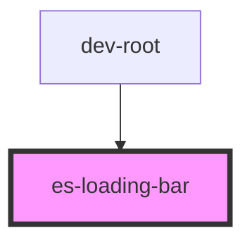

# es-loading-bar


<!-- Auto Generated Below -->


## Usage

### Example

```tsx
import { setProgress } from '@eventstore-ui/layout';
import { random } from 'helpers';

const updateBarProgress = setProgress('example');

export default () => <es-loading-bar name={'example'} />;

const fakeProgress = (current: number) => {
    setTimeout(() => {
        if (current >= 60 && random(12) > 6) {
            return errorOut();
        }

        const next = current === 100 ? 0 : Math.min(current + random(20), 100);
        updateBarProgress(next);
        fakeProgress(next);
    }, 800);
};

const errorOut = () => {
    updateBarProgress(100, 'error');
    fakeProgress(0);
};

fakeProgress(0);
```


## Properties

| Property            | Attribute | Description                              | Type     | Default     |
| ------------------- | --------- | ---------------------------------------- | -------- | ----------- |
| `name` _(required)_ | `name`    | The bar's name, for use in `setProgress` | `string` | `undefined` |


## Methods

### `progress(completion: number, status?: LoadingBarStatus) => Promise<void>`

Set (and animate to) a progress.

#### Returns

Type: `Promise<void>`


## Shadow Parts

| Part    | Description       |
| ------- | ----------------- |
| `"bar"` | The internal bar. |


## Dependencies

### Used by

 - dev-root

### Graph


----------------------------------------------


