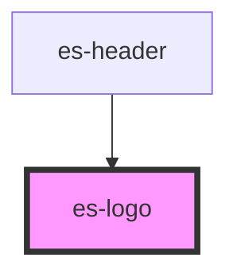

# es-logo


<!-- Auto Generated Below -->


## Overview

The Event Store logo.

## Usage

### Example

```tsx
export default () => <es-logo />;
```

```css
:host {
    display: flex;
    align-items: center;
    justify-content: center;
    background-color: #09254a;
}
```


## Properties

| Property | Attribute | Description                                 | Type               | Default  |
| -------- | --------- | ------------------------------------------- | ------------------ | -------- |
| `height` | `height`  | Height to constrain by.                     | `number`           | `40`     |
| `mode`   | `mode`    | If the eventstore text should be displayed. | `"full" \| "icon"` | `'full'` |
| `width`  | `width`   | Width to constrain by.                      | `number`           | `164`    |


## Shadow Parts

| Part          | Description                                     |
| ------------- | ----------------------------------------------- |
| `"ouroboros"` | The g element wrapping the ouroboros logo mark. |
| `"sequence"`  |                                                 |
| `"text"`      | the g element wrapping the Event Store text.    |


## Dependencies

### Used by

 - [es-header](../es-header)

### Graph


----------------------------------------------


