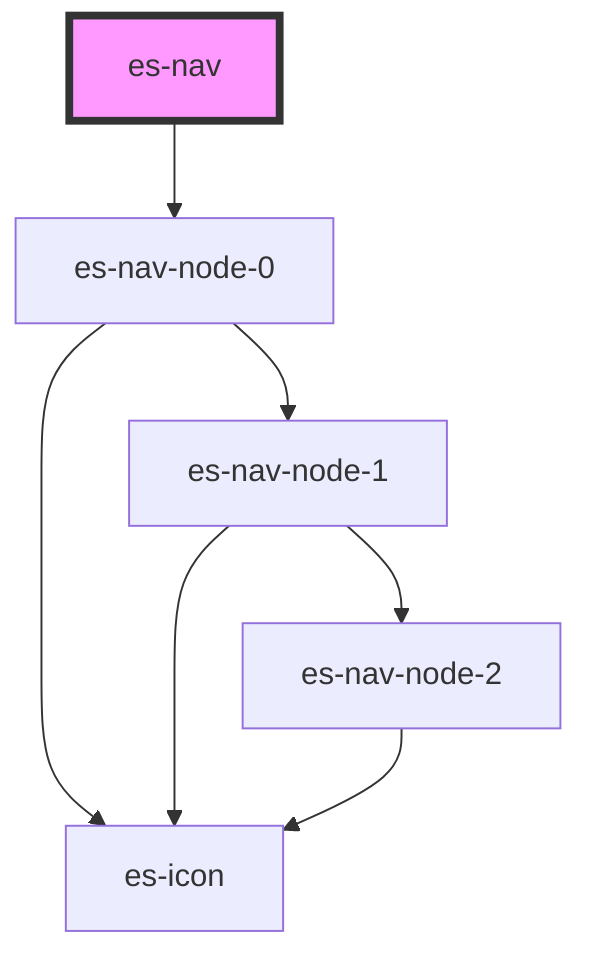

# es-header-nav


<!-- Auto Generated Below -->


## Usage

### Example

<!-- show-location -->

```tsx
import type { NavTree } from '@eventstore-ui/layout';

const navTree: NavTree = [
    {
        title: 'Waved albatross',
        url: '/etiam/justo/etiam/pretium',
    },
    {
        title: 'Gulls',
        children: [
            {
                title: 'Openbill',
                url: '/maecenas/tincidunt/lacus/at',
            },
            {
                title: 'Long-tailed',
                children: [
                    {
                        title: 'Ibex',
                        url: '/cubilia/curae/donec/pharetra/magna',
                    },
                    {
                        title: 'Paradoxure',
                        url: '/cubilia/curae/duis/faucibus/accumsan',
                    },
                ],
            },
            {
                title: 'Tamandua',
                children: [
                    {
                        title: 'Deer',
                        url: '/id/nisl/venenatis/lacinia/aenean',
                    },
                    {
                        title: 'Quail',
                        url: '/velit/vivamus/vel/nulla/eget/eros/elementum',
                    },
                    {
                        title: 'Slender Loris',
                        url: '/nisi/at/nibh/in/hac/habitasse',
                    },
                    {
                        title: 'Tarantula',
                        url: '/pretium/quis/lectus',
                    },
                ],
            },
        ],
    },
    {
        title: 'Southern sea lion',
        children: [
            {
                title: 'Lechwe',
                children: [
                    {
                        title: 'Ibex',
                        url: '/tortor/quis/turpis/sed/ante',
                    },
                    {
                        title: 'Tenrec, tailless',
                        url: '/a/ipsum/integer',
                    },
                ],
            },
            {
                title: 'Waxbill',
                children: [
                    {
                        title: 'Owl, great horned',
                        url: '/nisl',
                    },
                ],
            },
            {
                title: 'Goose, snow',
                url: '/faucibus/orci',
            },
            {
                title: 'Civet',
                children: [
                    {
                        title: 'American beaver',
                        url: '/tellus/in/sagittis/dui/vel/nisl/duis',
                    },
                    {
                        title: 'Cat',
                        url: '/purus/phasellus',
                    },
                    {
                        title: 'African wild cat',
                        url: '/augue/vel/accumsan',
                    },
                    {
                        title: 'Palm squirrel',
                        url: '/nunc/nisl/duis/bibendum/felis/sed/interdum',
                        disabled: true,
                    },
                ],
            },
            {
                title: 'Puma',
                url: '/mattis/pulvinar/nulla/pede/ullamcorper/augue/a',
            },
        ],
    },
    {
        title: 'Squirrel',
        children: [
            {
                title: 'Yellow-throated sandgrouse',
                children: [
                    {
                        title: 'Lapwing',
                        url: '/volutpat/sapien',
                    },
                    {
                        title: 'Painted stork',
                        url: '/erat/curabitur/gravida',
                    },
                    {
                        title: 'Dog',
                        url: '/neque/aenean/auctor',
                    },
                ],
            },
        ],
    },
    {
        title: "Hoffman's sloth",
        url: '/in/congue/etiam',
    },
    {
        title: 'Lava gull',
        url: '/morbi/vestibulum/velit/id/pretium',
    },
    {
        title: 'Common shelduck',
        children: [
            {
                title: 'Dragonfly',
                children: [
                    {
                        title: 'Magellanic penguin',
                        url: '/aenean',
                    },
                ],
            },
            {
                title: 'Grey phalarope',
                children: [
                    {
                        title: 'South American sea lion',
                        url: '/bibendum/imperdiet/nullam',
                    },
                    {
                        title: 'Salmon',
                        url: '/velit/nec/nisi/vulputate',
                    },
                    {
                        title: 'Wildebeest',
                        url: '/accumsan',
                    },
                ],
            },
        ],
    },
];

export default () => (
    <es-header>
        <es-nav navTree={navTree} slot={'under'} />
    </es-header>
);
```

```css
preview-usage-location {
    position: absolute;
    bottom: 0;
    border-top: 1px solid var(--color-shade-40);
    border-radius: 0;
    left: 0;
    right: 0;
}
```


## Properties

| Property               | Attribute | Description                                                                | Type        | Default     |
| ---------------------- | --------- | -------------------------------------------------------------------------- | ----------- | ----------- |
| `navTree` _(required)_ | --        | The `NavTree` data structure that the navigation menu will be built from.. | `NavNode[]` | `undefined` |


## Dependencies

### Depends on

- es-nav-node-0

### Graph


----------------------------------------------


