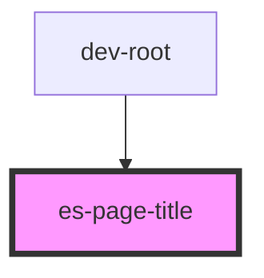

# es-page-title


<!-- Auto Generated Below -->


## Usage

### Example

```tsx
export default () => <es-page-title>{'A lovely page'}</es-page-title>;
```

```css
:host {
    display: flex;
    align-items: center;
    justify-content: center;
}
```


## Dependencies

### Used by

 - dev-root

### Graph


----------------------------------------------


