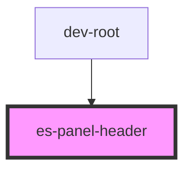

# es-panel-header


<!-- Auto Generated Below -->


## Usage

### Example

```tsx
import { randomIcon } from 'helpers';

export default () => (
    <es-panel>
        <es-panel-header>
            {'hello there'}
            <es-button variant={'minimal'} slot={'actions'}>
                <es-icon icon={randomIcon()} size={20} />
            </es-button>
            <es-button variant={'minimal'} slot={'actions'}>
                <es-icon icon={randomIcon()} size={20} />
            </es-button>
            <es-button variant={'minimal'} slot={'actions'}>
                <es-icon icon={randomIcon()} size={20} />
            </es-button>
        </es-panel-header>
        <p>{'I am a panel'}</p>
    </es-panel>
);
```


## Slots

| Slot        | Description                            |
| ----------- | -------------------------------------- |
| `"actions"` | Place clickable actions for the panel. |


## Shadow Parts

| Part        | Description            |
| ----------- | ---------------------- |
| `"actions"` | The actions area.      |
| `"title"`   | The title of the panel |


## Dependencies

### Used by

 - dev-root

### Graph


----------------------------------------------


