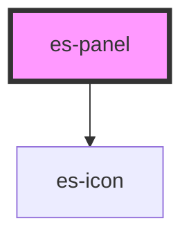

# es-panel


<!-- Auto Generated Below -->


## Usage

### Example

```tsx
export default () => (
    <es-panel>
        <es-panel-header>{'hello there'}</es-panel-header>
        <p>{'I am a panel'}</p>
    </es-panel>
);
```


## Shadow Parts

| Part      | Description                      |
| --------- | -------------------------------- |
| `"inner"` | The wrapping aside of the panel. |


## Dependencies

### Depends on

- es-icon

### Graph


----------------------------------------------


