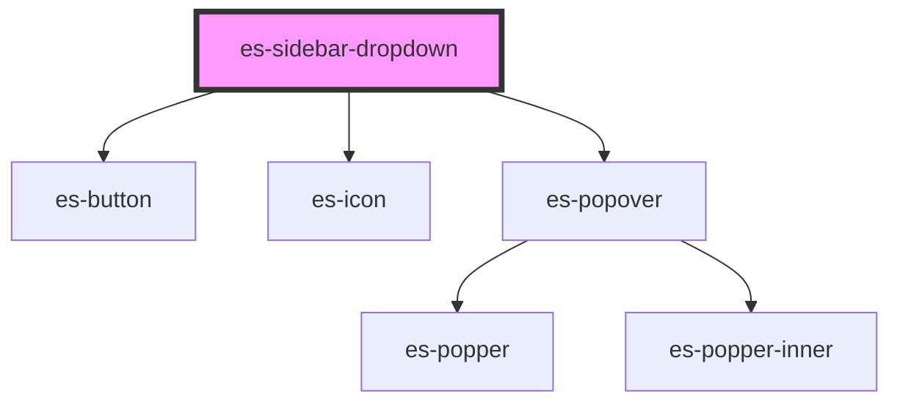

# es-sidebar-dropdown

<!-- Auto Generated Below -->


## Overview

A dropdown for the sidebar. Will automatically take the title and icon of the first active nested `es-layout-link` or `es-layout-button`.

## Usage

### Example

```tsx
import { Link } from '@eventstore-ui/router';
import { randomIcon } from 'helpers';

export default () => (
    <es-sidebar>
        <es-layout-section title={'Dropdown'}>
            <es-sidebar-dropdown
                defaultIcon={randomIcon()}
                defaultTitle={'Hello there'}
            >
                <es-layout-section
                    collapsable
                    defaultCollapsed
                    title={'Night Time'}
                >
                    <es-layout-link matchExact url={'/'} icon={randomIcon()}>
                        {'Hello!'}
                    </es-layout-link>
                    <es-layout-link url={'/somewhere'} icon={randomIcon()}>
                        {'Go somewhere'}
                    </es-layout-link>
                </es-layout-section>
                <es-layout-section collapsable title={'Day Time'}>
                    <es-layout-link url={'/good-morning'} icon={randomIcon()}>
                        {'Good morning!'}
                    </es-layout-link>
                    <es-layout-link url={'/work'} icon={randomIcon()}>
                        {'Go to work'}
                    </es-layout-link>
                </es-layout-section>
                <es-layout-section
                    collapsable
                    defaultCollapsed
                    title={'Another Time'}
                >
                    {Array.from({ length: 200 }, (_, i) => (
                        <es-layout-link
                            url={`/another-${i}`}
                            icon={randomIcon()}
                        >
                            {`Link ${i}`}
                        </es-layout-link>
                    ))}
                </es-layout-section>
            </es-sidebar-dropdown>
        </es-layout-section>
        <es-layout-section sectionTitle={'My Section'}>
            <es-layout-link url={'/'} icon={randomIcon()}>
                {'Hello!'}
            </es-layout-link>
            <es-layout-link url={'./preview'} icon={randomIcon()}>
                {'Go somewhere'}
            </es-layout-link>
        </es-layout-section>
        <es-layout-section sectionTitle={'My Other Section'}>
            <es-layout-link url={'/somewhere-else'} icon={randomIcon()}>
                {'Go somewhere else'}
            </es-layout-link>
            <es-layout-link url={'./home'} icon={randomIcon()}>
                {'Go nowhere'}
            </es-layout-link>
        </es-layout-section>
    </es-sidebar>
);
```


## Properties

| Property                    | Attribute       | Description                                                                    | Type                                                    | Default     |
| --------------------------- | --------------- | ------------------------------------------------------------------------------ | ------------------------------------------------------- | ----------- |
| `defaultIcon` _(required)_  | `default-icon`  | The icon to display if no nested es-layout-link or es-layout-button is active  | `[namespace: string \| symbol, name: string] \| string` | `undefined` |
| `defaultTitle` _(required)_ | `default-title` | The title to display if no nested es-layout-link or es-layout-button is active | `string`                                                | `undefined` |


## Dependencies

### Depends on

- es-button
- es-icon
- es-popover

### Graph


----------------------------------------------


