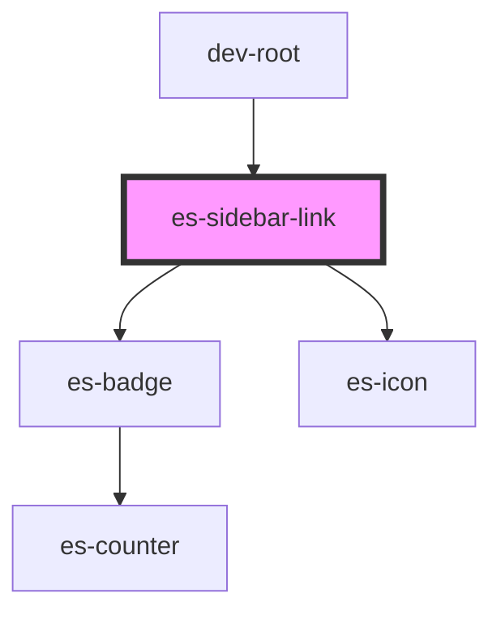

# docs-sidebar-link

<!-- Auto Generated Below -->


## Usage

### Example

```tsx
import { Link } from '@eventstore/router';
import { randomIcon } from 'helpers';

export default () => (
    <es-sidebar>
        <es-sidebar-section sectionTitle={'Links'}>
            <es-sidebar-link url={'/no-icon-1'}>
                {'Example link'}
            </es-sidebar-link>
            <es-sidebar-link url={'/preview'}>{'I am active'}</es-sidebar-link>
            <es-sidebar-link url={'/no-icon-1'}>
                {'Example link'}
            </es-sidebar-link>
            <es-sidebar-link disabled url={'/no-icon-2'}>
                {'Disabled example  '}
            </es-sidebar-link>
        </es-sidebar-section>
        <es-sidebar-section sectionTitle={'With Icon'}>
            <es-sidebar-link url={'/icon-1'} icon={randomIcon()}>
                {'With Icon'}
            </es-sidebar-link>
            <es-sidebar-link disabled url={'/icon-2'} icon={randomIcon()}>
                {'Disabled'}
            </es-sidebar-link>
            <es-sidebar-link url={'/icon-1'} icon={randomIcon()}>
                {'Another'}
            </es-sidebar-link>
            <es-sidebar-link url={'/icon-1'} icon={randomIcon()}>
                {'More Icon'}
            </es-sidebar-link>
        </es-sidebar-section>
        <es-sidebar-section sectionTitle={'Alert levels'}>
            <es-sidebar-link
                alertLevel={'error'}
                url={'/icon-1'}
                icon={randomIcon()}
            >
                {'Error'}
            </es-sidebar-link>
            <es-sidebar-link
                alertLevel={'warning'}
                url={'/icon-1'}
                icon={randomIcon()}
            >
                {'Warning'}
            </es-sidebar-link>
            <es-sidebar-link
                alertLevel={'okay'}
                url={'/icon-1'}
                icon={randomIcon()}
            >
                {'Okay'}
            </es-sidebar-link>
        </es-sidebar-section>
        <es-sidebar-section sectionTitle={'Level Example'}>
            <es-sidebar-link url={'/icon-1'} level={1}>
                {'Level 1'}
            </es-sidebar-link>
            <es-sidebar-link url={'/icon-1'} level={1}>
                {'Level 1'}
            </es-sidebar-link>
            <es-sidebar-link url={'/icon-1'} level={2}>
                {'Level 2'}
            </es-sidebar-link>
            <es-sidebar-link url={'/icon-1'} level={2}>
                {'Level 2'}
            </es-sidebar-link>
            <es-sidebar-link url={'/icon-1'} level={1}>
                {'Level 1'}
            </es-sidebar-link>
            <es-sidebar-link url={'/icon-1'} level={2}>
                {'Level 2'}
            </es-sidebar-link>
            <es-sidebar-link url={'/icon-1'} level={3}>
                {'Level 3'}
            </es-sidebar-link>
            <es-sidebar-link url={'/icon-1'} level={3}>
                {'Level 3'}
            </es-sidebar-link>
            <es-sidebar-link url={'/icon-1'} level={1}>
                {'Level 1'}
            </es-sidebar-link>
        </es-sidebar-section>
    </es-sidebar>
);
```


## Properties

| Property      | Attribute      | Description                                                  | Type                                                                 | Default     |
| ------------- | -------------- | ------------------------------------------------------------ | -------------------------------------------------------------------- | ----------- |
| `alertLevel`  | `alert-level`  | Display a dot on the icon, to attract attention to the link. | `"error" \| "okay" \| "warning" \| undefined`                        | `undefined` |
| `disabled`    | `disabled`     | If the link should be disabled.                              | `boolean`                                                            | `false`     |
| `icon`        | `icon`         | Display an icon on the left.                                 | `[namespace: string \| symbol, name: string] \| string \| undefined` | `undefined` |
| `level`       | `level`        | Apply an indent to the left of the link, for basic nesting.  | `number \| undefined`                                                | `undefined` |
| `matchExact`  | `match-exact`  | Use exact url matching for active.                           | `boolean \| undefined`                                               | `undefined` |
| `matchStrict` | `match-strict` | Use strict url matching for active.                          | `boolean \| undefined`                                               | `undefined` |
| `matchUrl`    | `match-url`    | When to display as active. Uses the `url` by default.        | `string \| undefined`                                                | `undefined` |
| `url`         | `url`          | Where to link to.                                            | `string \| undefined`                                                | `undefined` |


## Methods

### `isActive() => Promise<boolean>`

If the link is currently active

#### Returns

Type: `Promise<boolean>`


## Shadow Parts

| Part     | Description       |
| -------- | ----------------- |
| `"link"` | The link element. |


## Dependencies

### Used by

 - dev-root

### Depends on

- es-badge
- es-icon

### Graph


----------------------------------------------


