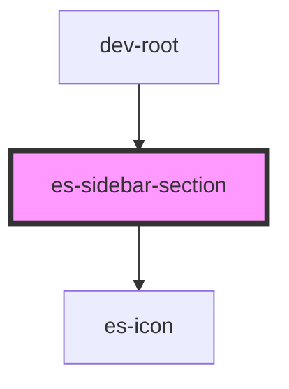

# docs-sidebar-section

<!-- Auto Generated Below -->


## Usage

### Example

```tsx
import { Link } from '@eventstore/router';
import { randomIcon } from 'helpers';

export default () => (
    <es-sidebar>
        <es-sidebar-section>
            <es-sidebar-link url={'/'}>
                {'My section has no title'}
            </es-sidebar-link>
        </es-sidebar-section>
        <es-sidebar-section sectionTitle={'I am a section'}>
            <es-sidebar-link url={'/somewhere-else'}>
                {'My section has a title'}
            </es-sidebar-link>
        </es-sidebar-section>
    </es-sidebar>
);
```


## Properties

| Property           | Attribute           | Description                                   | Type                  | Default     |
| ------------------ | ------------------- | --------------------------------------------- | --------------------- | ----------- |
| `collapsable`      | `collapsable`       | If the section is collapsable                 | `boolean`             | `false`     |
| `defaultCollapsed` | `default-collapsed` | If the section should be collapsed by default | `boolean`             | `false`     |
| `sectionTitle`     | `title`             | Optionally renders a title                    | `string \| undefined` | `undefined` |


## Shadow Parts

| Part          | Description                      |
| ------------- | -------------------------------- |
| `"header"`    | The header containing the title. |
| `"nav"`       | The nav element.                 |
| `"nav_inner"` | The element inside the nav.      |
| `"title"`     | The title h1 element.            |


## Dependencies

### Used by

 - dev-root

### Depends on

- es-icon

### Graph


----------------------------------------------


