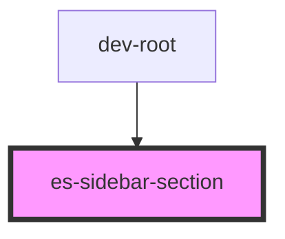

# docs-sidebar-section

<!-- Auto Generated Below -->


## Usage

### Example

```tsx
import { Link } from '@eventstore/router';
import { randomIcon } from 'helpers';

export default () => (
    <es-sidebar>
        <es-sidebar-section>
            <es-sidebar-link url={'/'}>
                {'My section has no title'}
            </es-sidebar-link>
        </es-sidebar-section>
        <es-sidebar-section sectionTitle={'I am a section'}>
            <es-sidebar-link url={'/somewhere-else'}>
                {'My section has a title'}
            </es-sidebar-link>
        </es-sidebar-section>
    </es-sidebar>
);
```


## Properties

| Property       | Attribute       | Description                | Type                  | Default     |
| -------------- | --------------- | -------------------------- | --------------------- | ----------- |
| `sectionTitle` | `section-title` | Optionally renders a title | `string \| undefined` | `undefined` |


## Dependencies

### Used by

 - dev-root

### Graph


----------------------------------------------


