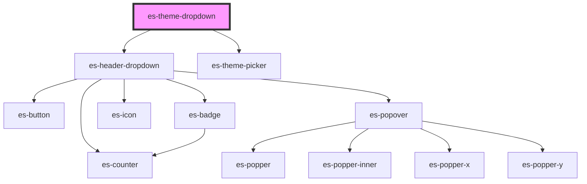

# es-theme-dropdown


<!-- Auto Generated Below -->


## Overview

A theme picker dropdown for the header

## Usage

### Example

```tsx

export default () => (
    <es-header>
        <es-theme-dropdown slot={'right'} />
        <es-nav
            navTree={[
                {
                    title: 'Link 1',
                    url: '/a',
                },
                {
                    title: 'Link 2',
                    url: '/b',
                },
                {
                    title: 'Link 3',
                    url: '/c',
                },
            ]}
            slot={'under'}
        />
    </es-header>
);
```


## Properties

| Property  | Attribute | Description                   | Type                       | Default     |
| --------- | --------- | ----------------------------- | -------------------------- | ----------- |
| `variant` | `variant` | Which styling variant to use. | `"default" \| "highlight"` | `'default'` |


## Dependencies

### Depends on

- [es-header-dropdown](../es-header-dropdown)
- [es-theme-picker](../es-theme-picker)

### Graph


----------------------------------------------


