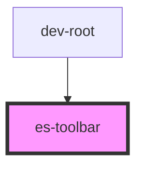

# docs-sidebar

<!-- Auto Generated Below -->


## Usage

### Example

```tsx
import { randomIcon } from 'helpers';

export default () => (
    <es-toolbar>
        <menu>
            <li>
                <es-button>
                    <es-icon icon={randomIcon()} />
                </es-button>
            </li>
            <li>
                <es-button>
                    <es-icon icon={randomIcon()} />
                </es-button>
            </li>
        </menu>
    </es-toolbar>
);
```

```css
menu {
    all: unset;
    display: block;
    padding: 10px;
    padding-top: 32px;
}

li {
    all: unset;
    display: block;
    margin-bottom: 10px;
}
```


## Dependencies

### Used by

 - dev-root

### Graph


----------------------------------------------


