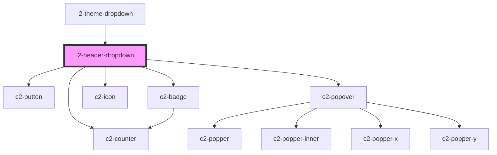

# l2-sidebar-dropdown

<!-- Auto Generated Below -->


## Overview

A dropdown for the header.

## Usage

### Example

```tsx
import { randomIcon } from 'utils/helpers';

export default () => (
    <l2-header>
        <l2-header-dropdown
            slot={'right'}
            icon={randomIcon()}
            buttonText={'JJJ'}
        >
            <header class={'user_dropdown_header'}>
                <c2-icon icon={randomIcon()} />
                <h1>{'John John Johnson'}</h1>
                <h2>{'jjj@johnson.com'}</h2>
            </header>
            <l2-layout-link
                matchExact
                url={'/'}
                count={22}
                alertLevel={'error'}
            >
                {'Hello!'}
            </l2-layout-link>
            <l2-layout-link url={'/somewhere'} icon={randomIcon()}>
                {'Go somewhere'}
            </l2-layout-link>
        </l2-header-dropdown>
        <l2-theme-dropdown slot={'right'} />
        <l2-nav
            navTree={[
                {
                    title: 'Link 1',
                    url: '/a',
                },
                {
                    title: 'Link 2',
                    url: '/b',
                },
                {
                    title: 'Link 3',
                    url: '/c',
                },
            ]}
            slot={'under'}
        />
    </l2-header>
);
```

```css
.user_dropdown_header {
    display: flex;
    flex-direction: column;
    align-items: center;
    justify-content: center;
    padding: 20px;
    background-color: var(--color-shade-20);
    color: var(--color-foreground);
}

.user_dropdown_header c2-icon {
    color: var(--color-highlight);
}

.user_dropdown_header h1 {
    font-size: 16px;
    font-weight: 500;
    margin-top: 17px;
    margin-bottom: 5px;
}

.user_dropdown_header h2 {
    font-size: 12px;
    font-weight: 500;
    margin: 0;
}
```


## Properties

| Property     | Attribute     | Description                                                    | Type                                                                 | Default     |
| ------------ | ------------- | -------------------------------------------------------------- | -------------------------------------------------------------------- | ----------- |
| `alertLevel` | `alert-level` | Display a dot on the icon, to attract attention to the button. | `"error" \| "okay" \| "warning" \| undefined`                        | `undefined` |
| `buttonText` | `button-text` | text for use in the button.                                    | `string \| undefined`                                                | `undefined` |
| `caret`      | `caret`       | If a caret should be rendered.                                 | `boolean`                                                            | `true`      |
| `count`      | `count`       | Display a counter in place of the icon.                        | `number \| undefined`                                                | `undefined` |
| `disabled`   | `disabled`    | If the button should be disabled.                              | `boolean`                                                            | `false`     |
| `icon`       | `icon`        | Icon for use in the button.                                    | `[namespace: string \| symbol, name: string] \| string \| undefined` | `undefined` |
| `level`      | `level`       | Apply an indent to the left of the button, for basic nesting.  | `number \| undefined`                                                | `undefined` |


## Shadow Parts

| Part        | Description |
| ----------- | ----------- |
| `"counter"` | the counter |


## Dependencies

### Used by

 - [l2-theme-dropdown](../theme-dropdown)

### Depends on

- c2-button
- c2-counter
- c2-badge
- c2-icon
- c2-popover

### Graph


----------------------------------------------


