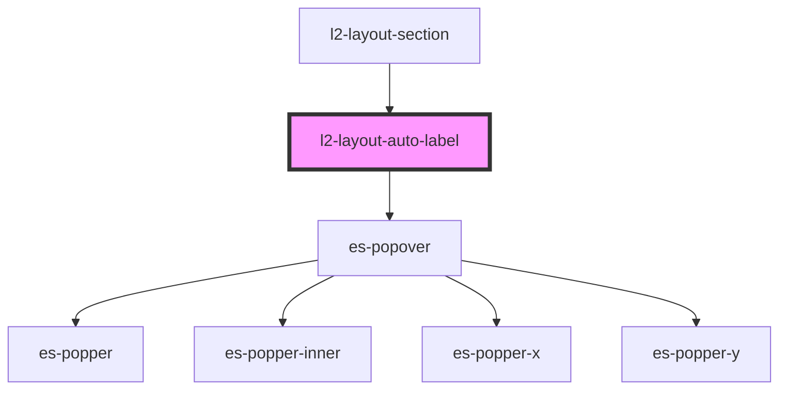

# es-popover-group

<!-- Auto Generated Below -->

## Properties

| Property                 | Attribute   | Description                                   | Type                                                                                                                                                                 | Default                                                                                                                        |
| ------------------------ | ----------- | --------------------------------------------- | -------------------------------------------------------------------------------------------------------------------------------------------------------------------- | ------------------------------------------------------------------------------------------------------------------------------ |
| `extractLabel`           | --          | How to extract the label text                 | `(($el: HTMLElement) => string) \| undefined`                                                                                                                        | `undefined`                                                                                                                    |
| `placement` _(required)_ | `placement` | Where to place the label                      | `"bottom" \| "bottom-end" \| "bottom-start" \| "left" \| "left-end" \| "left-start" \| "right" \| "right-end" \| "right-start" \| "top" \| "top-end" \| "top-start"` | `undefined`                                                                                                                    |
| `selector`               | `selector`  | Selector for selecting elements to auto label | `string`                                                                                                                                                             | `[         'l2-layout-link:not([disable-auto-label])',         'l2-layout-button:not([disable-auto-label])',     ].join(', ')` |

## Dependencies

### Used by

 - [l2-layout-section](../layout-section)

### Depends on

- es-popover

### Graph

----------------------------------------------

