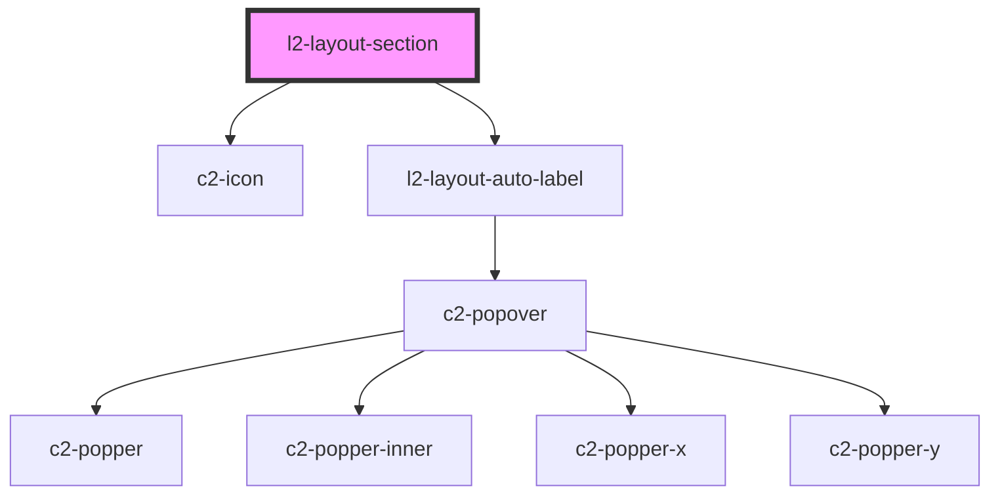

# docs-sidebar-section

<!-- Auto Generated Below -->


## Overview

A section with an optional title for containing layout-links

## Usage

### Example

```tsx
export default () => (
    <l2-sidebar>
        <l2-layout-section>
            <l2-layout-link url={'/'}>
                {'My section has no title'}
            </l2-layout-link>
        </l2-layout-section>
        <l2-layout-section sectionTitle={'I am a section'}>
            <l2-layout-link url={'/somewhere-else'}>
                {'My section has a title'}
            </l2-layout-link>
        </l2-layout-section>
    </l2-sidebar>
);
```


## Properties

| Property           | Attribute           | Description                                              | Type                                 | Default       |
| ------------------ | ------------------- | -------------------------------------------------------- | ------------------------------------ | ------------- |
| `autoLabel`        | `auto-label`        | If the section should label it's contents with a popover | `"collapsed" \| "inline" \| boolean` | `'collapsed'` |
| `collapsable`      | `collapsable`       | If the section is collapsable                            | `boolean`                            | `false`       |
| `defaultCollapsed` | `default-collapsed` | If the section should be collapsed by default            | `boolean`                            | `false`       |
| `sectionTitle`     | `title`             | Optionally renders a title                               | `string \| undefined`                | `undefined`   |


## Shadow Parts

| Part          | Description                      |
| ------------- | -------------------------------- |
| `"header"`    | The header containing the title. |
| `"nav"`       | The nav element.                 |
| `"nav_inner"` | The element inside the nav.      |
| `"title"`     | The title h1 element.            |


## Dependencies

### Depends on

- c2-icon
- [l2-layout-auto-label](../layout-auto-label)

### Graph


----------------------------------------------


