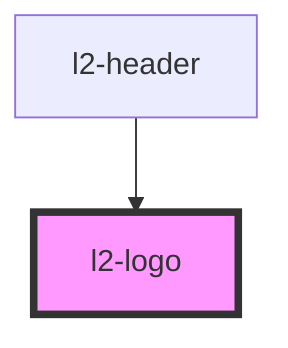

# l2-logo

<!-- Auto Generated Below -->


## Overview

The Event Store logo.

## Usage

### Example

```tsx
export default () => <l2-logo />;
```

```css
:host {
    display: flex;
    align-items: center;
    justify-content: center;
}
```


## Properties

| Property | Attribute | Description                              | Type               | Default  |
| -------- | --------- | ---------------------------------------- | ------------------ | -------- |
| `height` | `height`  | Height to constrain by.                  | `number`           | `40`     |
| `mode`   | `mode`    | If the kurrent text should be displayed. | `"full" \| "icon"` | `'full'` |
| `width`  | `width`   | Width to constrain by.                   | `number`           | `164`    |


## Shadow Parts

| Part         | Description                    |
| ------------ | ------------------------------ |
| `"sequence"` | The path for the logo mark.    |
| `"text"`     | The path for the Kurrent text. |


## Dependencies

### Used by

 - [l2-header](../header)

### Graph


----------------------------------------------


