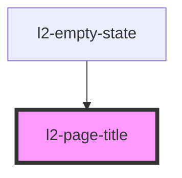

# l2-page-title

<!-- Auto Generated Below -->


## Overview

Standard page title

## Usage

### Example

```tsx
export default () => <l2-page-title>{'A lovely page'}</l2-page-title>;
```

```css
:host {
    display: flex;
    align-items: center;
    justify-content: center;
}
```


## Dependencies

### Used by

 - [l2-empty-state](../empty-state)

### Graph


----------------------------------------------


