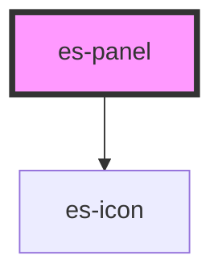

# es-panel

<!-- Auto Generated Below -->


## Overview

A resizable panel. Automatically sets the relevant layout var based on it's size and when resized.

## Usage

### Example

```tsx
export default () => (
    <es-panel>
        <es-panel-header>{'hello there'}</es-panel-header>
        <p>{'I am a panel'}</p>
    </es-panel>
);
```


## Properties

| Property       | Attribute       | Description                                                                 | Type                                                                                         | Default     |
| -------------- | --------------- | --------------------------------------------------------------------------- | -------------------------------------------------------------------------------------------- | ----------- |
| `area`         | `area`          | Where to place the panel.                                                   | `"banner" \| "cookie" \| "panel" \| "sidebar" \| "toolbar"`                                  | `'panel'`   |
| `closeAt`      | `close-at`      | When to snap the panel closed (if a closed mode is set).                    | `number`                                                                                     | `100`       |
| `closedMode`   | `closed-mode`   | How the panel should respond to being closed.                               | `"collapsed" \| "none"`                                                                      | `'none'`    |
| `closedSize`   | `closed-size`   | How large the panel should be when closed.                                  | `number`                                                                                     | `34`        |
| `defaultSize`  | `default-size`  | What size to default to.                                                    | `number`                                                                                     | `200`       |
| `end`          | `end`           | Where to end the panel, inclusive. Must be the opposite axis to the area.   | `"banner" \| "body" \| "cookie" \| "edge" \| "panel" \| "sidebar" \| "toolbar" \| undefined` | `undefined` |
| `maximumSize`  | `maximum-size`  | The maximum possible size to resize to.                                     | `number`                                                                                     | `Infinity`  |
| `minimumSize`  | `minimum-size`  | The minimum possible size to resize to.                                     | `number`                                                                                     | `100`       |
| `rememberMode` | `remember-mode` | If the last mode of the panel should be kept in local storage.              | `boolean \| string \| undefined`                                                             | `undefined` |
| `rememberSize` | `remember-size` | If the size of the panel should be kept in local storage.                   | `boolean \| string \| undefined`                                                             | `undefined` |
| `start`        | `start`         | Where to start the panel, inclusive. Must be the opposite axis to the area. | `"banner" \| "body" \| "cookie" \| "edge" \| "panel" \| "sidebar" \| "toolbar" \| undefined` | `undefined` |


## Events

| Event        | Description                             | Type                                   |
| ------------ | --------------------------------------- | -------------------------------------- |
| `modeChange` | Triggers when the panel's mode changes. | `CustomEvent<"collapsed" \| "inline">` |


## Shadow Parts

| Part                 | Description                      |
| -------------------- | -------------------------------- |
| `"handle"`           | The grabbable handle             |
| `"handle collapsed"` | The handle while collapsed       |
| `"handle inline"`    | The handle while inline          |
| `"handle_icon"`      | The handle grips icon            |
| `"inner"`            | The wrapping aside of the panel. |


## Dependencies

### Depends on

- es-icon

### Graph


----------------------------------------------


