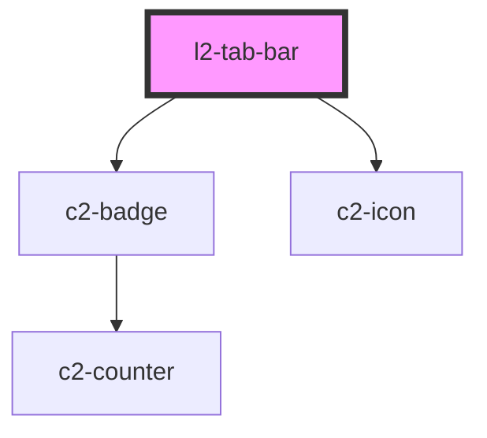

# c2-tab-bar


<!-- Auto Generated Below -->


## Overview

A navigating tab bar.

## Usage

### Example

```tsx
import type { RouteTab } from '@kurrent-ui/layout';
import { Link, Route, Switch } from '@kurrent-ui/router';

const tabs: RouteTab[] = [
    {
        id: 'tab-1',
        title: 'One',
    },
    {
        id: 'tab-2',
        title: 'Two',
        badge: () => true,
    },
    {
        id: 'tab-3',
        title: 'Three',
        url: '/tab-three',
    },
    {
        id: 'tab-4',
        title: 'Four',
    },
];

export default () => (
    <>
        <l2-tab-bar tabs={tabs} />
        <Switch>
            <Route
                url={'/tab-1'}
                routeRender={() => <p>{'I am in tab 1'}</p>}
            />
            <Route
                url={'/tab-2'}
                routeRender={() => <p>{'Welcome to tab 2!'}</p>}
            />
            <Route
                url={'/tab-three'}
                routeRender={() => <p>{'Hello 👋. You have reached tab 3.'}</p>}
            />
            <Route
                url={'/tab-4'}
                routeRender={() => (
                    <div>
                        <p>{'Tab 4 now'}</p>
                        <br />
                        <Link url={'/tab-1'}>{'go to one'}</Link>
                        <br />
                        <Link url={'/tab-20'}>{'go nowhere'}</Link>
                    </div>
                )}
            />
        </Switch>
    </>
);
```


## Properties

| Property            | Attribute             | Description                                           | Type                                                                 | Default     |
| ------------------- | --------------------- | ----------------------------------------------------- | -------------------------------------------------------------------- | ----------- |
| `interTabIcon`      | `inter-tab-icon`      | Icon to be rendered between each tab.                 | `[namespace: string \| symbol, name: string] \| string \| undefined` | `undefined` |
| `interTabIconSize`  | `inter-tab-icon-size` | thu size of the icon to be rendered between each tab. | `number`                                                             | `20`        |
| `tabs` _(required)_ | --                    | A list of tabs.                                       | `RouteTab[]`                                                         | `undefined` |


## Events

| Event       | Description                                                                 | Type                  |
| ----------- | --------------------------------------------------------------------------- | --------------------- |
| `tabChange` | Triggered when the active tab is changed. `detail` is the newly active tab. | `CustomEvent<string>` |


## Shadow Parts

| Part               | Description                       |
| ------------------ | --------------------------------- |
| `"[tabName]"`      | The tab.                          |
| `"active"`         | The active tab.                   |
| `"indicator"`      | The sliding indicatior bar.       |
| `"inter-tab-icon"` | Icon between tabs (if specified). |
| `"tab"`            | Tabs.                             |


## CSS Custom Properties

| Name                      | Description                                                          |
| ------------------------- | -------------------------------------------------------------------- |
| `--active-color`          | The active text color of the tab, and color of the active indicator; |
| `--border-color`          | The color of border surrounding the tab content;                     |
| `--focus-color`           | The focused text color of the tab;                                   |
| `--focus-indicator-color` | The color of the focus indicator;                                    |
| `--inactive-color`        | The inactive text color of the tab;                                  |


## Dependencies

### Depends on

- c2-badge
- c2-icon

### Graph


----------------------------------------------


