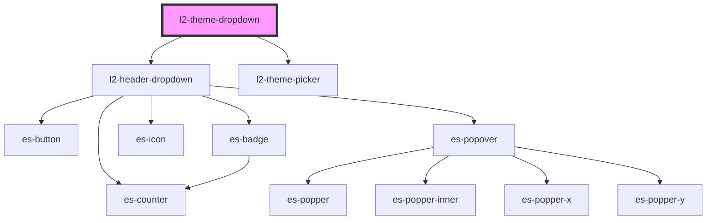

# l2-theme-dropdown

<!-- Auto Generated Below -->


## Overview

A theme picker dropdown for the header

## Usage

### Example

```tsx
export default () => (
    <l2-header>
        <l2-theme-dropdown slot={'right'} />
        <l2-nav
            navTree={[
                {
                    title: 'Link 1',
                    url: '/a',
                },
                {
                    title: 'Link 2',
                    url: '/b',
                },
                {
                    title: 'Link 3',
                    url: '/c',
                },
            ]}
            slot={'under'}
        />
    </l2-header>
);
```


## Dependencies

### Depends on

- [l2-header-dropdown](../header-dropdown)
- [l2-theme-picker](../theme-picker)

### Graph


----------------------------------------------


